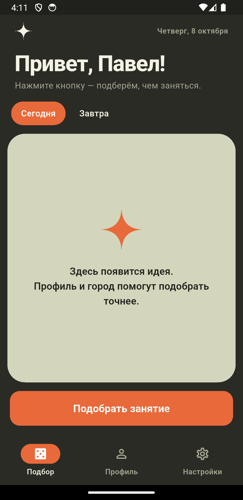
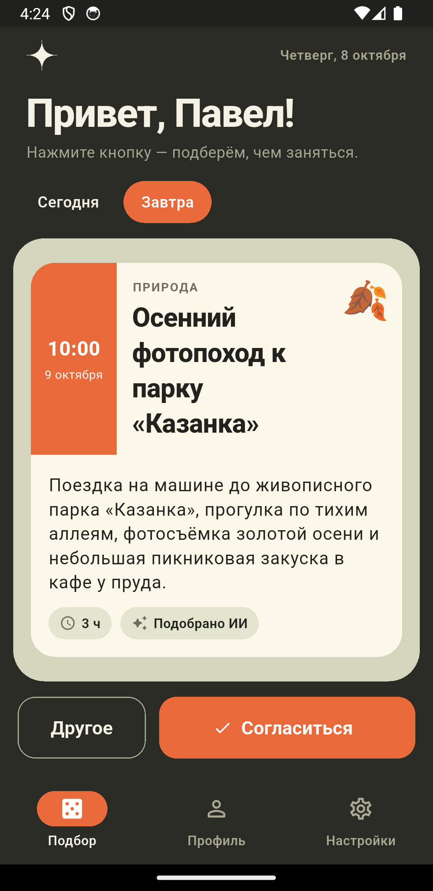
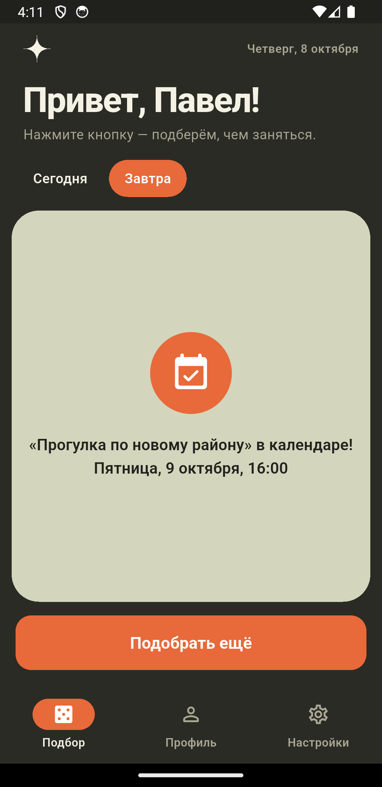
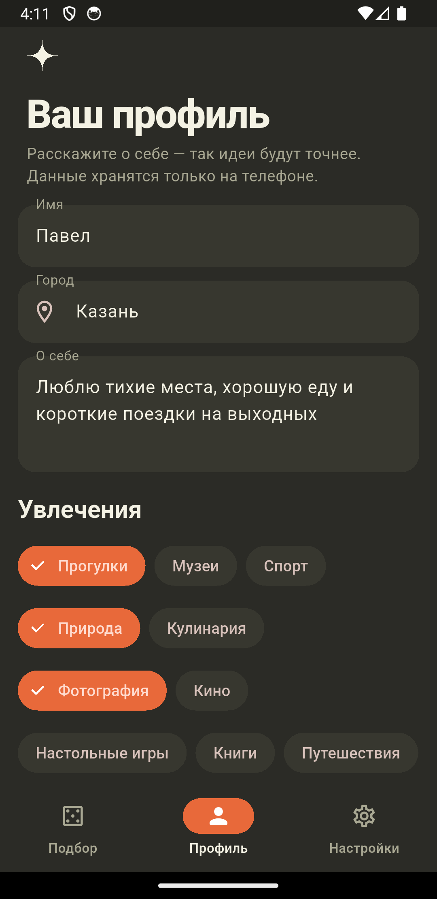
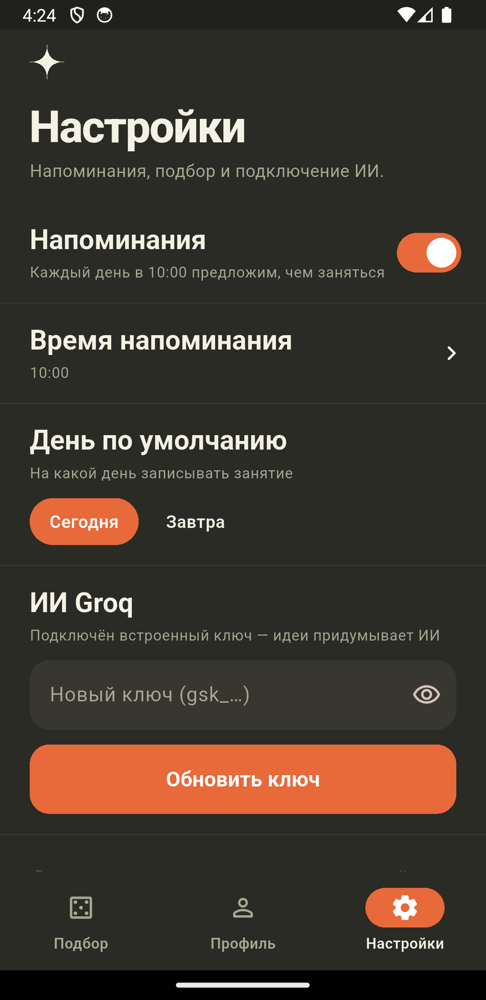
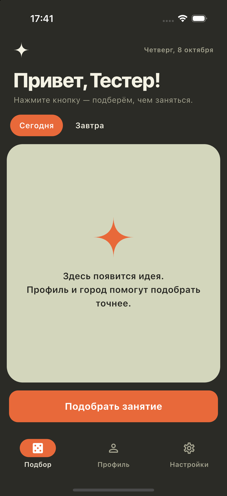
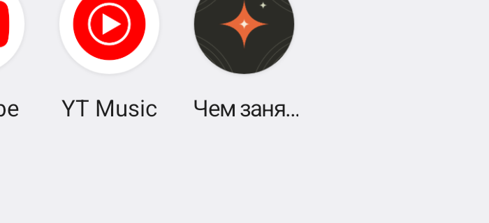

<p align="center">
  
</p>

<h1 align="center">Чем заняться?</h1>

<p align="center">
  Рандомайзер занятий для iOS и Android.<br/>
  Нажимаете кнопку — получаете идею. Понравилась — она уже в вашем календаре.
</p>

<p align="center">
  
  
  
</p>
<p align="center">
  
  
  
</p>
<p align="center"><sub>Android (Pixel 3a) и iPhone 16 Pro</sub></p>

## Как это работает

1. **Выберите день** — «Сегодня» или «Завтра».
2. **Нажмите «Подобрать занятие».** Приложение учтёт ваш город, увлечения,
   наличие машины, бюджет, день недели и время года. Например, предложит
   прогуляться по новому району, сходить в музей или съездить за город покормить уток.
3. **«Согласиться»** — занятие записывается в календарь телефона с напоминанием
   за 30 минут. **«Другое»** — подбирается новая идея. Отклонённые варианты
   больше не предлагаются.

## Экраны

| Экран | Что на нём |
|---|---|
| **Подбор** | Выбор дня, карточка занятия: время, дата, категория, описание, длительность и источник идеи (ИИ или каталог). |
| **Профиль** | Имя, город, «о себе», увлечения (готовые и свои), есть ли машина, бюджет. Всё хранится только на телефоне. |
| **Настройки** | Ежедневное напоминание в выбранное время, день по умолчанию, ключ ИИ Groq (можно обновить), форма обратной связи. |

## Откуда берутся идеи

- **ИИ Groq** (бесплатно). Модель `openai/gpt-oss-120b` получает ваш профиль и
  отвечает строго по JSON-схеме на русском языке, обычно за 1–2 секунды.
- **Встроенный каталог.** Работает без ключа и без интернета, тоже учитывает
  машину, бюджет и увлечения. Если ИИ недоступен (нет сети, исчерпан лимит,
  неверный ключ), приложение само переключается на каталог и сообщает об этом.

### Ключ Groq

- **Встроенный ключ** попадает в приложение при сборке из файла `secrets.json`
  (файл в `.gitignore`, в репозиторий не попадает):

  ```json
  { "GROQ_API_KEY": "gsk_..." }
  ```

  Образец — `secrets.example.json`.
- **Обновить ключ в приложении:** **Настройки → ИИ Groq** → вставьте новый ключ →
  **Обновить ключ**. Свой ключ заменяет встроенный; кнопка
  **Вернуть встроенный ключ** отменяет замену. Получить бесплатный ключ:
  <https://console.groq.com/keys>.

## Обратная связь

**Настройки → Обратная связь**: имя (подставляется из профиля), почта для ответа
(необязательно) и сообщение. Письмо с темой «Приложение "чем заняться". Форма
обратной связи» уходит на pasharus73@gmail.com через бесплатный сервис
[FormSubmit](https://formsubmit.co) — своего сервера и ключей не нужно.
Почту отправителя FormSubmit ставит в Reply-To, так что на письмо можно просто
ответить. При самом первом письме FormSubmit присылает на этот адрес просьбу
подтвердить его — нажмите «Activate Form», иначе письма не будут доставляться.

## Календарь и напоминания

- Событие создаётся в календаре по умолчанию. Если на телефоне нет ни одного
  календаря (нет аккаунтов), приложение создаёт свой локальный календарь
  «Чем заняться?».
- Если выбрано «Сегодня», а рекомендуемое время уже прошло, событие ставится
  на ближайший полный час (не позже 22:00, иначе на завтра).
- Ежедневное напоминание («Не знаете, чем заняться?») включается в настройках.
  Время можно поменять; после перезагрузки телефона напоминание восстанавливается.

## Установка

### Android

Готовый файл: `build/app/outputs/flutter-apk/app-release.apk`. Скопируйте его на
телефон и откройте (потребуется разрешить установку из неизвестных источников).

### iPhone

1. Один раз примите лицензию Xcode: `sudo xcodebuild -license accept`.
2. Откройте `ios/Runner.xcworkspace` в Xcode → **Runner → Signing & Capabilities** →
   выберите свой Apple ID (Personal Team).
3. Подключите iPhone и выполните `flutter run --release --dart-define-from-file=secrets.json`.

С бесплатным Apple ID приложение работает 7 дней, потом его нужно переустановить.

## Разработка

Нужны Flutter (stable), JDK 17 и Android SDK; для iOS — Xcode.

```bash
flutter pub get
flutter analyze               # статический анализ
flutter test                  # 75 тестов: модели, Groq, каталог, календарь, ключи, контроллеры, экраны
flutter test --coverage       # покрытие ≈ 90%
flutter build apk --release --dart-define-from-file=secrets.json   # Android
flutter build ios --release --dart-define-from-file=secrets.json   # iOS
```

### Сквозные тесты на устройстве

`integration_test/app_test.dart` запускает настоящее приложение с реальными
календарём, уведомлениями, хранилищем и живым Groq:

1. первый запуск и русский интерфейс;
2. профиль сохраняется на устройстве и подхватывается приветствием;
3. Groq подбирает занятие, «Другое» даёт новую идею;
4. «Согласиться» создаёт событие в календаре телефона (тест находит его и удаляет);
5. неверный ключ → идея из каталога с пояснением; обновление и сброс ключа;
6. ежедневное напоминание планируется и отменяется (только Android, см. ниже);
7. выбор календаря для записи на реальном списке календарей.

```bash
tool/integration_android.sh            # Android: сборка, установка, разрешения, прогон
tool/integration_ios.sh <udid>         # iOS-симулятор (udid: xcrun simctl list devices)
```

Системные диалоги разрешений тест нажать не может, поэтому скрипты выдают
разрешения заранее: на Android — `pm grant`, на iOS — `simctl privacy grant calendar`
(и запускают тесты через `flutter drive`, который, в отличие от `flutter test`,
не удаляет приложение вместе с выданным доступом). Разрешение на уведомления на
iOS выдаётся только через системный диалог, поэтому сценарий 6 там пропускается
и проверяется вручную.

Последний прогон: Android 14 (эмулятор Pixel 3a) — 7/7, iOS 18.5 (симулятор
iPhone 16 Pro) — 6/6 + 1 пропущен.

### Архитектура

```
lib/
  core/      русские даты и форматирование
  domain/    модели: профиль, настройки, занятие, расчёт времени события
  data/      Groq, офлайн-каталог, календарь, уведомления, локальное хранилище
  state/     Riverpod: провайдеры и контроллер подбора
  ui/        экраны «Подбор», «Профиль», «Настройки», тема и общие виджеты
test/        юнит-, контроллер- и виджет-тесты
tool/        генератор иконки
```

- **Состояние:** Riverpod 3 (`Notifier`). Платформенные зависимости (календарь,
  уведомления, HTTP, часы, хранилище) подключаются через провайдеры и в тестах
  подменяются фейками.
- **Данные:** `shared_preferences`, только на устройстве.
- **Платформа:** `device_calendar`, `flutter_local_notifications`, `http`.
- **CI:** `.github/workflows/ci.yml` проверяет форматирование, запускает анализатор
  и тесты, собирает APK и прикладывает его к сборке. Ключ для сборки берётся из
  секрета репозитория `GROQ_API_KEY`.

### Иконка

Иконка рисуется кодом, в том же стиле, что и интерфейс. Чтобы перегенерировать:

```bash
flutter test tool/generate_icon_test.dart   # PNG в assets/icon/
dart run flutter_launcher_icons             # иконки Android/iOS
dart run flutter_native_splash:create       # заставка при запуске
```

<p>
  
</p>
